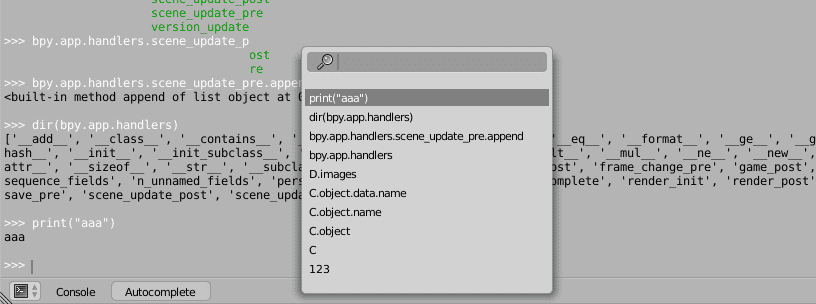

# Bl Console History Menu

Show console history menu

> [**Download**](https://raw.githubusercontent.com/a-nakanosora/Blender-Small-Addons/master/bl_console_history_menu/bl_console_history_menu.py)

## Installation
1. `Blender User Preference` > `Install from File` > Select `bl_console_history_menu.py`
2. Activate `Console: Bl Console History Menu` in Addons Preference

## Usage
press `F3` key in Blender Console to show the history menu
