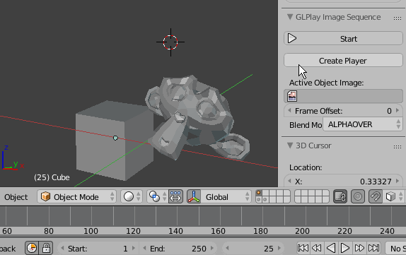

# GL Play Image Sequence

Play image sequence on viewport playback

> [**Download**](https://raw.githubusercontent.com/a-nakanosora/Blender-Small-Addons/master/glplay_image_sequence/glplay_image_sequence.py)

## Installation
1. `Blender User Preference` > `Install from File` > Select `glplay_image_sequence.py`
2. Activate `3D View: GL Play Image Sequence` in Addons Preference

## Usage

#### Object Options:
  * `Active Object Image` : Select an image sequence
  * `Frame Offset` : Offset start frame of player
  * `BlendMode`
  * `Transparency` : Use when active image sequence has transparency. (<!> but sometimes it may cause strange behaviour.)
