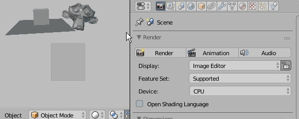

# Jump to Prev/Next Property Type

Activate hotkeys - jump to prev/next property type

> [**Download**](https://raw.githubusercontent.com/a-nakanosora/Blender-Small-Addons/master/jump_property_type/jump_property_type.py)

## Installation
1. `Blender User Preference` > `Install from File` > Select `jump_property_type.py`
2. Activate `UI: Jump to Prev/Next Property Type` in Addons Preference

## Usage

Press hotkey `F1` / `F2` to jump prroperty type to prev/next
