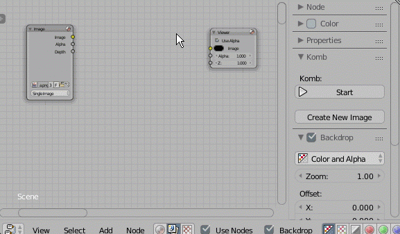

# Komb

Quick make a mask image for composite

> [**Download**](https://raw.githubusercontent.com/a-nakanosora/Blender-Small-Addons/master/komb/komb.py)

## Installation
1. `Blender User Preference` > `Install from File` > Select `komb.py`
2. Activate `Image: Komb` in Addons Preference

## Usage

1. Open `Node Editor > Compositing`
2. Add a `Viewer Node` and connect it to your target node (e.g. `Render Layers Node`, `Image Node`)
3. Press `Komb > Create New Image` button, type new image name and press `OK`
    to create new blank image and its image node will be added.
    (Note: `Width/Height` are automatically set as same size as `Viewer Node` image)
4. Set active the image node and press `Komb > Start` button to start draw mode
    * [Ctrl+Left Mouse Drag] : draw
    * `Bake` button : apply draw to current target image. you can change the target image through `Bake to:` image selector.
    * `Clear Image` button : clear current target image
    * `Exit` button : exit draw mode

Hotkeys:
  * [X ] : Swap brush color
  * [Esc] : exit draw mode
  
