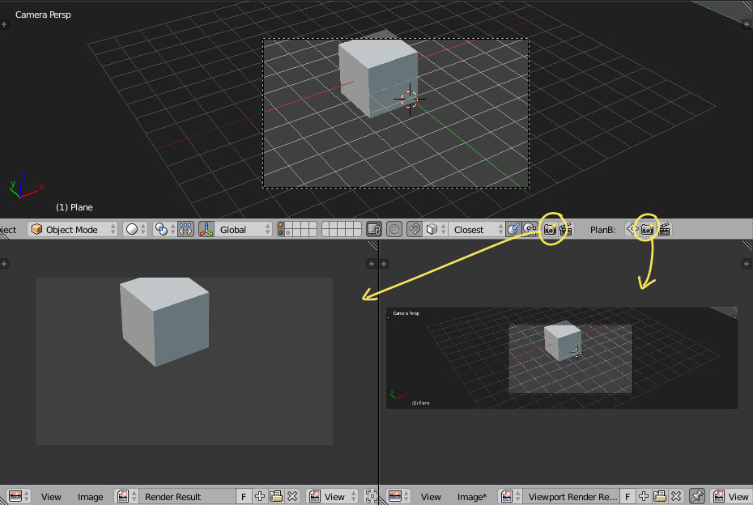

# OpenGL Render Plan B

render active viewport as an image considering OpenGL draw callbacks

### [Download](https://raw.githubusercontent.com/a-nakanosora/Blender-Small-Addons/master/opengl_render_plan_b/opengl_render_plan_b.py)

*<!> still WIP and Buggy*

## Installation
1. `Blender User Preference` > `Install from File` > Select `opengl_render_plan_b.py`
2. Activate `3D View: OpenGL Render Plan B` in Addons Preference

## Usage

* `Render` : render viewport as image (Image Slot -> `Viewport Render Result`)
* `Render Animation` : render and save each frame

* `Center Camera View` : put camera view center

