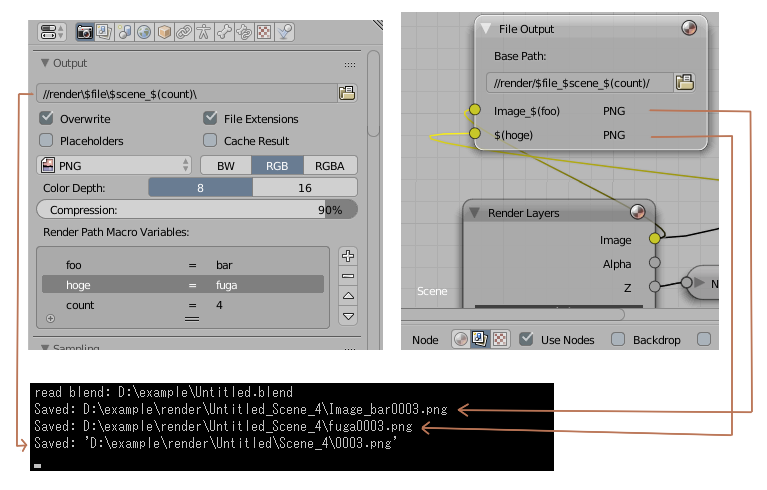
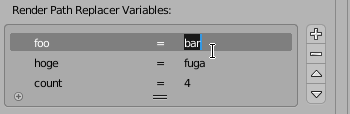

# Render Path Auto Replacer

Replace render output filepaths at rendering according to several syntaxes

> [**Download**](https://raw.githubusercontent.com/a-nakanosora/Blender-Small-Addons/master/render_path_auto_replacer/render_path_auto_replacer.py)

## Installation

1. `Blender User Preference` > `Install from File` > Select `render_path_auto_replacer.py`
2. Activate `Render: Render Path Auto Replacer` in Addons Preference

## Usage

### Replacing paths

* While this addon is enabled, Render Paths are automatically replaced at start/end of rendering.
* The target paths are `Properties > Render Settings > Output`, `Compositing Nodes > File Output Node`'s `Base Path` and its `File Subpaths`.

### Path Replacer Special Words

There are several special words. If the path contained these words, they will be replaced to other words at rendering.
> *e.g.*
> `d:/bl_render_out/$file/$scene/` => `d:/bl_render_out/Untitled/Scene/`
> `//render/$file_$scene_$camera_$(foobar)/` => `//render/Untitled_Scene_Camera_baz/`

* `$file` : Current blender file name
* `$scene` : Scene name
* `$camera` : Active camera name
* `$time` : POSIX timestamp at rendering started (e.g. "1505235365" [sec])
* `$timestamp` *(deprecated)* : POSIX timestamp at rendering started (e.g. "1505235365.960109" [sec])
* `$(<variable-name>)` : A user defined replacer variable (see below)

### Replacer Variables

The `Render Path Replacer Variables` panel exists in `Properties > Render Settings > Output`. it can define `Replacer Variables`.
For example, if a variable is set as `foo = bar`, word `$(foo)` in the paths will be replaced to `bar` at rendering.
